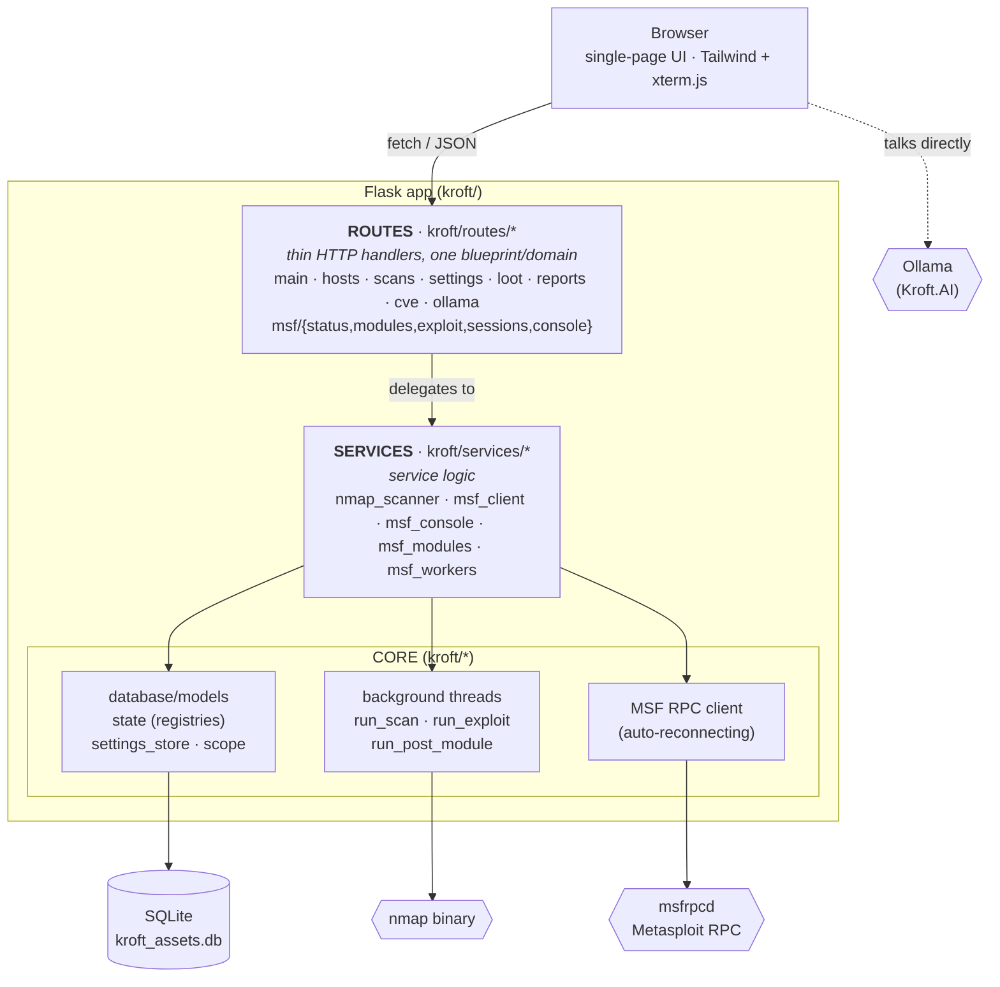

# KROFT Security Matrix


A self-hosted, single-operator network reconnaissance and exploitation console.
Kroft puts three tools behind one dark-themed web UI:

1. **nmap** for asset discovery and service/OS fingerprinting.
2. **Metasploit Framework** (through its RPC daemon, `msfrpcd`) for module search,
   exploitation, post-exploitation, session handling, and an interactive console.
3. **Kroft.AI**, an in-browser LLM advisor backed by [Ollama](https://ollama.com).
   It reads your recon data, suggests MSF modules that actually exist, explains
   output, and can run a guided "autopilot" loop.

Everything an engagement produces (discovered hosts, exploit attempts, captured
loot) is stored in a local SQLite database, so it survives restarts and can be
exported.

> ⚠️ **Authorized use only.** Kroft is for testing systems you own or have
> explicit permission to assess. There's a configurable scope guardrail that
> blocks intrusive actions against out-of-scope hosts, but treat it as a safety
> net, not as your authorization.

---

## Table of contents

- [Features](#features)
- [Architecture](#architecture)
- [Project structure](#project-structure)
- [How it works](#how-it-works)
- [Setup](#setup)
- [Configuration](#configuration)
- [API reference](#api-reference)
- [Security notes](#security-notes)
- [Development](#development)

---

## Features

The UI is a single page with nine tabs, each backed by part of the API:

| Tab | What it does |
| --- | --- |
| **Asset Matrix** | Host inventory. Lists every discovered host with ports, OS guess, MAC, tags, and last-seen time. You can tag, delete, and export to CSV/JSON. |
| **Advanced Scanner** | Launches nmap scans with an allow-listed set of flags. Scans run in the background and progress is polled. |
| **Findings & Loot** | Credentials, hashes, keys, and other findings, de-duplicated and tied back to a host/source. |
| **Pentest Console** | Search MSF exploit modules, inspect their options and payloads, and fire them at a target. |
| **Active Shells** | Lists live shell/meterpreter sessions and lets you run commands in them. |
| **Kroft.AI** | An LLM advisor and autonomous agent. It grounds suggestions in real modules through the suggest/validate endpoints, can execute MSF command blocks, and reads back the output. |
| **Cyberspace** | A 3D, real-time view of the engagement (three.js): your network floats as glowing nodes around the Kroft core, the AI agent moves between them scanning and exploiting, owned hosts turn green and pivot, and DB activity streaks packets to and from the core. There's a scrubbable timeline to replay everything. It's cosmetic, just a view onto the real tools. |
| **Post / Auxiliary Console** | Runs post and auxiliary modules and captures their output. |
| **MSF Console** | A full interactive `msf6 >` terminal in the browser (xterm.js). |

There's also CVE enrichment (NVD lookups for a product/version), engagement scope
enforcement, and persistent storage for all of the above.

---

## Architecture

Kroft is a Flask application split into three layers, plus the background workers
and external services it drives.



A few rules the code follows:

- Routes are thin. Each blueprint validates input and calls a service; it doesn't
  hold business logic.
- Each service owns one concern. The Metasploit RPC quirks, nmap argument
  handling, and worker logic all live in `kroft/services/`, kept separate so
  they're easier to test.
- Long-running work happens off-thread. Scans and exploits are handed to daemon
  threads that record progress in in-memory registries, and the UI polls for
  status. The HTTP request returns right away with a `job_id`.
- The MSF connection is managed in one place. A single background thread keeps the
  RPC connection alive; everything else calls `get_msf()` to grab a live client
  (or `None`) without blocking.
- `create_app()` is an application factory that builds and wires everything up, so
  importing the app has no surprising side effects.

---

## Project structure

```
.
├── app.py                      # Entry point: create_app().run()  (Docker CMD targets this)
├── kroft/                      # The application package
│   ├── __init__.py             # create_app() application factory
│   ├── config.py               # Env-driven configuration (DB, MSF, Ollama, server)
│   ├── database.py             # SQLAlchemy engine, Session factory, init_db() + migrations
│   ├── models.py               # ORM models: Host, ExploitLog, Loot, Setting
│   ├── settings_store.py       # get_setting / set_setting (key-value store)
│   ├── state.py                # In-memory registries + locks (jobs, sessions, consoles)
│   ├── scope.py                # Engagement scope guardrail (in_scope)
│   ├── events.py               # In-memory ring buffer of activity events (for the visualizer)
│   ├── activity.py             # after_request hook: maps DB/action routes -> events
│   ├── services/               # Service layer
│   │   ├── nmap_scanner.py     #   nmap arg allow-list, conflict resolution, port-merge, run_scan worker
│   │   ├── msf_client.py       #   auto-reconnecting MSF RPC connection manager + get_msf()
│   │   ├── msf_console.py      #   safe wrappers around the msfrpcd console API + banner stripping
│   │   ├── msf_modules.py      #   module search / validate / suggest, compatible payloads
│   │   └── msf_workers.py      #   run_exploit + run_post_module background workers
│   └── routes/                 # HTTP layer, one Flask blueprint per domain
│       ├── __init__.py         #   register_blueprints(app)
│       ├── main.py             #   GET /                       (serves the UI)
│       ├── hosts.py            #   /api/hosts*                 (inventory, tags, export)
│       ├── scans.py            #   /api/scan, /api/jobs        (nmap dispatch + status)
│       ├── settings.py         #   /api/settings
│       ├── loot.py             #   /api/loot*
│       ├── reports.py          #   /api/report/<ip>
│       ├── cve.py              #   /api/cve                    (NVD enrichment)
│       ├── ollama.py           #   /api/ollama/models
│       ├── events.py           #   /api/events                 (visualizer event feed)
│       └── msf/                #   /api/msf/* grouped by concern
│           ├── __init__.py     #     shared `bp` blueprint
│           ├── status.py       #     status + db_nmap scan
│           ├── modules.py      #     search / suggest / validate / info
│           ├── exploit.py      #     exploit & post/aux dispatch, jobs, output, logs
│           ├── sessions.py     #     session list / exec / read / kill
│           └── console.py      #     console_exec + interactive console
├── templates/                  # Server-rendered HTML (Jinja2)
│   ├── index.html              # Page shell: <head> + s + ordered <script> tags
│   └── partials/               # HTML components, assembled by index.html
│       ├── _styles.html        #   the Tailwind <style> block (kept inline for the CDN JIT)
│       ├── _sidebar.html       #   left-hand navigation
│       ├── _header.html        #   top bar (title, scope indicator, settings)
│       ├── tabs/               #   one file per tab: _matrix, _scanner, _pentest, _shells,
│       │                       #     _msfconsole, _kroftai, _cyberspace, _postaux, _findings
│       └── modals/             #   _settings, _report, _job_detail
├── static/                     # Browser assets served at /static
│   └── js/                     # Front-end logic, split by feature, loaded in order
│       ├── 01-core.js          #   globals, clock, tab switching
│       ├── 02-scanner.js       #   nmap scanner + jobs queue
│       ├── 03-matrix.js        #   asset matrix
│       ├── 04-pentest.js       #   pentest console + "Hail Mary"
│       ├── 05-shells.js        #   shells / xterm terminals
│       ├── 06-kroftai.js       #   Kroft.AI: status, chat, analysis
│       ├── 07-ai-commands.js   #   AI command blocks + job-output injection
│       ├── 08-postaux.js       #   post/aux panel, job-detail modal, post/aux console
│       ├── 09-console.js       #   interactive MSF console + Ollama model picker
│       ├── 10-findings.js      #   findings/loot, settings/scope, report
│       ├── 11-extras.js        #   notifications, cred reuse, auto post-recon, CVE
│       ├── 12-autopilot.js     #   autonomous agent loop
│       ├── 13-init.js          #   bootstrap calls on page load
│       └── 14-cyberspace.js    #   3D visualizer: recorder, scene, choreography, playback
├── kroft_assets.db             # SQLite database (created/updated at runtime)
├── requirements.txt            # Python dependencies
├── Pipfile                     # Pipenv equivalent of requirements
├── Dockerfile                  # Builds the scanner image (installs nmap + deps)
└── docker-compose.yml          # Runs the scanner + a Metasploit RPC container together
```

---

## How it works

### Data model (`kroft/models.py`)

Four SQLite tables hold everything persistent:

- **`Host`** is one row per discovered asset: IP, MAC, hostname, OS guess, open
  ports (both a readable string and structured JSON), status, last-seen time, and
  user tags.
- **`ExploitLog`** is the audit trail: every exploit/auxiliary/post run with its
  module, options, status, result, and any session id it produced.
- **`Loot`** holds findings (credentials, hashes, keys, and so on), de-duplicated
  on `(host_ip, type, value)`.
- **`Setting`** is a key/value store. Right now its main job is the engagement
  `scope_cidr`.

`init_db()` creates the tables on startup and runs a small migration that adds the
`tags` column to older databases.

### nmap scanning (`services/nmap_scanner.py`)

A scan request returns a `job_id` right away and the work happens in a daemon
thread (`run_scan`):

1. Sanitize the user's flags. `sanitize_args()` tokenizes the input and checks
   each token (and its value, for flags like `-p 80`) against
   `ALLOWED_ARG_PATTERN`. Anything not on the allow-list is dropped and reported
   as a warning; raw flags never reach nmap.
2. Resolve conflicts. Mutually exclusive flags (say, a ping-sweep `-sn` next to
   `-sV`) get pruned.
3. Scan and persist. Discovered hosts are upserted with merge-not-clobber
   semantics, so a narrow follow-up scan won't erase OS/port/version data a
   broader earlier scan picked up (`merge_ports`).

### Metasploit integration

This is the most defensive part of the app. `msfrpcd` and the `pymetasploit3`
client sometimes return a bare `bool` where you'd expect a `dict` or `list`, which
otherwise blows up deep inside the library with `"'bool' object is not
subscriptable"`. Kroft works around it in a few places:

- `msf_client.py` runs one background thread that connects to `msfrpcd`,
  health-checks it every 10s by reading `core.version`, and reconnects when that
  fails. Callers use `get_msf()` to get a live client immediately, or `None`. They
  never block.
- `msf_console.py` calls the console RPCs directly and checks the shape of each
  response, instead of going through `msf.consoles.console()` (whose manager
  subscripts an unvalidated response on every call). It also strips the noisy
  Metasploit startup banner before output is shown or fed to the AI.
- `msf_modules.py` confirms a module is loadable before handing its name to
  `modules.use()`, and offers "did you mean" suggestions for bad module paths by
  searching the live module DB.
- `msf_workers.py` runs exploits and post/auxiliary modules in daemon threads:
  - `run_exploit` validates the module, sets options, picks `LHOST` (the routable
    IP toward the target) and the best compatible payload (with a special case for
    bind-shell-only modules), executes through the low-level module manager to
    dodge the library's payload-validation crash, then polls up to 30s for a new
    session.
  - `run_post_module` drives a console (`use`, then `set ...`, then `run -j`), polls
    for output, strips the banner, and records the result.

Dispatch is routed by module type on purpose: auxiliary and post modules must not
be loaded as `exploit/...`, so the exploit endpoint spots those prefixes and sends
them to the console-based worker instead.

### In-memory state (`state.py`)

Live activity that doesn't belong in the database sits in process-wide registries
behind locks: `active_jobs` (scans), `exploit_jobs` (exploit/aux/post),
`msf_sessions` (open sessions), and `msf_consoles` (interactive terminals). The UI
polls the matching endpoints to show real-time status.

### Kroft.AI

The AI advisor runs in the browser and talks to an Ollama server directly
(streaming chat). The Flask backend only exposes `/api/ollama/models` so the UI
can fill its model dropdown. To keep the AI honest, it uses Kroft's own endpoints
as tools:

- `/api/msf/modules/suggest` and `/validate`, so it only proposes modules that
  exist in your Metasploit install,
- `/api/msf/console_exec` to run command blocks (output is banner-stripped and
  truncated to fit the model's context),
- `/api/report/<ip>` to pull together everything known about a host for a write-up.

Autopilot mode wraps this in a loop: pick one action, look at the result, pick the
next.

### Frontend (no build step)

The UI is plain server-rendered HTML plus vanilla JavaScript. No npm, no bundler,
no framework. Tailwind and xterm.js load from CDNs, so there's nothing to compile.

- HTML is composed with Jinja2 includes. `templates/index.html` is just a shell:
  the `<head>`, the page skeleton, and a series of ``
  tags. Each tab, modal, the sidebar, and the header live in their own partial
  under `templates/partials/`. The Tailwind `<style>` block stays inline (in
  `_styles.html`) because the Tailwind Play CDN compiles it at runtime.
- JavaScript is split by feature into ordered files under `static/js/`
  (`01-core.js` through `13-init.js`), loaded with plain `<script>` tags at the
  end of the body. They're classic scripts, not ES modules, so they share one
  global scope, the same way the original single inline script did. That's what
  keeps every inline `onclick="..."` handler working as-is.
- Load order matters. The files load in the order the code was originally written,
  and `13-init.js` (which kicks off `fetchHosts()` and friends) runs last, after
  every function is defined. When you edit, keep load-time calls in the file that
  defines what they use (or in `13-init.js`).

### Cyberspace visualizer

The **Cyberspace** tab ([static/js/14-cyberspace.js](static/js/14-cyberspace.js))
is a three.js scene driven entirely by Kroft's real telemetry; it doesn't script
anything. It's cosmetic, a view onto the live tools, and safe to ignore.

It runs on two clocks:

- A recorder that's always on. A light poll (every ~2s) of `/api/hosts`,
  `/api/jobs`, `/api/msf/jobs`, `/api/msf/sessions` and `/api/events` runs from
  page load, even while the tab is hidden, and writes a timestamped timeline: when
  each host was discovered, its status transitions, session open/close times, and
  the discrete "something happened" pulses. That timeline is what makes playback
  possible. The data model has no three.js in it, so recording never depends on the
  renderer.
- A renderer that only runs when the tab is visible. The WebGL render loop starts
  on tab-open and pauses on tab-close, so it doesn't waste GPU. Each frame it
  rebuilds the scene at the current playhead time `T` (which hosts exist, their
  status colors, which are owned), so the same code path serves both live mode
  (`T = now`) and replay (`T = wherever you dragged the scrubber`).

Visual language: hosts are wireframe nodes around the glowing Kroft core; status
sets the color (blue discovered, amber scanning, red under-attack, green owned); a
green AI drone flies to the active target and fires scan/exploit beams at its
ports; owned hosts grow an inner bot and beam pivot traffic to the next victim; and
every interesting server action sends a bright packet that arcs along a slow,
decaying orbit before its destination swallows it (CVE lookups arc out to a distant
*internet* node and back). Data that lands in the core (loot, recon, CVE intel)
crystallizes into a colored shard that stays inside the core, so it visibly fills
up as the engagement goes on. There's a packet-color key in the HUD, and clicking
any host opens a floating 3D dossier that types out its nmap details (click again
to dismiss).

The packet pulses come from the event feed ([kroft/events.py](kroft/events.py)):
an `after_request` hook ([kroft/activity.py](kroft/activity.py)) maps the handful
of routes that mean real DB/MSF activity (loot stored, module looked up, CVE
queried, exploit dispatched, and so on) onto a bounded in-memory ring buffer, which
the visualizer polls via `/api/events`. Routine UI polling is deliberately not
recorded, so the traffic stays meaningful.

### Request lifecycle (example: launching an exploit)

```
POST /api/msf/exploit {target_ip, module, options}
  -> routes/msf/exploit.py: validate input + scope check (scope.in_scope)
  -> create exploit_jobs[job_id]; spawn thread -> services/msf_workers.run_exploit
  -> return {job_id}                                   (immediately)
...meanwhile, the worker thread:
  -> validate module, set options, pick payload/LHOST, execute via MSF RPC
  -> poll for a new session; update exploit_jobs[job_id] + ExploitLog row
UI polls GET /api/msf/jobs and GET /api/msf/jobs/<job_id>/output for status.
```

---

## Setup

### Option A: Docker Compose (recommended)

This brings up both the Kroft web app and a Metasploit RPC daemon, wired together
on a private Docker network.

```bash
docker compose up --build
```

Then open <http://localhost:5000>.

What Compose starts:

- `msf-rpc`, the official `metasploitframework/metasploit-framework` image running
  `msfrpcd` (password `msfrpc`, port `55553`). Its data persists to `./msf_data`.
- `kroft-scanner`, this app, built from the `Dockerfile` (which installs nmap and
  the Python deps). It's configured through environment variables to reach the RPC
  container and runs privileged so nmap can do OS detection and raw-socket scans.

### Option B: Run locally

You'll need Python 3.10+, the `nmap` binary, and a running `msfrpcd` if you want
the Metasploit features.

```bash
# 1. System dependency
sudo apt-get install -y nmap            # (or your platform's package manager)

# 2. Python dependencies
python3 -m venv .venv && source .venv/bin/activate
pip install -r requirements.txt

# 3. (Optional) start the Metasploit RPC daemon
msfrpcd -P msfrpc -S -a 127.0.0.1 -p 55553 -f

# 4. Run Kroft
python app.py
```

Open <http://localhost:5000>. The app starts fine without Metasploit; the MSF
features just report "not connected" until `msfrpcd` is reachable.

> **Note:** OS detection and some scan types need root/raw-socket privileges. Run
> with appropriate privileges (or use the privileged Docker container).

> **Dev vs. debug:** `python app.py` runs with debug off by default
> (production-safe). For the auto-reloader and interactive debugger while
> developing, set `KROFT_DEBUG=1`. Never do that in production, since Werkzeug's
> debugger is a remote-code-execution console.

### Running in production

Two things shape how you have to deploy Kroft:

1. Single process, always. Live state (scan jobs, exploit jobs, sessions,
   consoles) lives in in-memory registries (`kroft/state.py`). Threads are fine,
   but multiple worker processes aren't: each gets its own copy, and the UI would
   see jobs and sessions blink in and out. Run exactly one worker.
2. Debug off. Make sure `KROFT_DEBUG` is unset or `0`.

`app` is the WSGI callable, so put a single-worker production server in front of
the Flask dev server:

```bash
# gunicorn: one worker, many threads (threads carry the concurrency)
gunicorn --workers 1 --threads 8 --timeout 120 app:app

# ...or waitress (no system deps)
waitress-serve --threads=8 --listen=0.0.0.0:5000 app:app
```

Since this is effectively a remote-controlled exploitation platform, also put it
behind authentication or a VPN and bind it to a trusted interface. See
[Security notes](#security-notes).

---

## Configuration

All configuration is through environment variables (see `kroft/config.py`), and
every one has a working default.

| Variable | Default | Purpose |
| --- | --- | --- |
| `MSF_HOST` | `127.0.0.1` | Host of the Metasploit RPC daemon. |
| `MSF_PORT` | `55553` | Port of `msfrpcd`. |
| `MSF_PASSWORD` | `msfrpc` | RPC password. |
| `OLLAMA_BASE` | `https://ollama.yourdomain.com` | Ollama server used by Kroft.AI (the **browser** has to be able to reach this). |
| `KROFT_DB` | `sqlite:///kroft_assets.db` | SQLAlchemy database URL. |
| `KROFT_HOST` | `0.0.0.0` | Bind address (used by `kroft/config.py`; `app.py` runs on `0.0.0.0:5000`). |
| `KROFT_PORT` | `5000` | Port. |
| `KROFT_DEBUG` | `1` | Flask debug flag. |

The engagement scope (`scope_cidr`) isn't an environment variable. You set it at
runtime in the **Settings** UI (or with `POST /api/settings`), and it's stored in
the database. An empty scope allows all targets; otherwise intrusive actions are
limited to the listed CIDR(s).

---

## API reference

All responses are JSON unless noted.

### Recon & assets

| Method | Path | Description |
| --- | --- | --- |
| `GET` | `/` | The single-page UI. |
| `POST` | `/api/scan` | Start an nmap scan. Body: `{target, custom_args}` -> `{job_id}`. |
| `GET` | `/api/jobs` | List nmap scan jobs (most recent first). |
| `GET` | `/api/hosts` | List all discovered hosts. |
| `DELETE` | `/api/hosts/<id>` | Delete a host. |
| `POST` | `/api/hosts/<id>/tags` | Set a host's tags. Body: `{tags}`. |
| `GET` | `/api/hosts/export?format=csv\|json` | Export the inventory. |

### Findings, reporting & enrichment

| Method | Path | Description |
| --- | --- | --- |
| `GET` | `/api/loot[?host=<ip>]` | List loot (optionally filtered by host). |
| `POST` | `/api/loot` | Add loot item(s) (deduped). Body: a loot object or `{items:[...]}`. |
| `DELETE` | `/api/loot/<id>` | Delete a loot item. |
| `GET` | `/api/report/<ip>` | Aggregate host + exploit logs + loot for a report. |
| `GET` | `/api/cve?q=<product+version>` | NVD CVE lookup (best-effort, cached). |
| `GET`/`POST` | `/api/settings` | Read / write the key-value settings (e.g. `scope_cidr`). |

### Metasploit

| Method | Path | Description |
| --- | --- | --- |
| `GET` | `/api/msf/status` | RPC connection status + version. |
| `POST` | `/api/msf/scan` | Run `db_nmap` inside Metasploit. Body: `{target}`. *(scope-checked)* |
| `GET` | `/api/msf/modules/search?q=&type=` | Search modules. |
| `POST` | `/api/msf/modules/suggest` | Verified module suggestions from recon keywords. Body: `{keywords, type}`. |
| `GET` | `/api/msf/modules/validate?module=&type=` | Check a module loads; suggest alternatives if not. |
| `GET` | `/api/msf/modules/info?module=&type=` | Module options, payloads, references. |
| `POST` | `/api/msf/exploit` | Dispatch an exploit (or aux/post). Body: `{target_ip, module, options}` -> `{job_id}`. *(scope-checked)* |
| `POST` | `/api/msf/post` | Dispatch a post/auxiliary module. Body: `{module, options, type}` -> `{job_id}`. |
| `GET` | `/api/msf/jobs` | List MSF exploit/aux/post jobs. |
| `GET` | `/api/msf/jobs/<job_id>/output` | Full captured output for a job. |
| `POST` | `/api/msf/jobs/<job_id>/kill` | Kill one MSF framework job. |
| `POST` | `/api/msf/jobs/kill_all` | Kill all MSF framework jobs. |
| `GET` | `/api/msf/exploit_logs` | Recent exploit log entries (audit trail). |
| `GET` | `/api/msf/sessions` | List live sessions (synced from MSF). |
| `POST` | `/api/msf/sessions/<sid>/exec` | Run a command in a session. Body: `{cmd}`. |
| `GET` | `/api/msf/sessions/<sid>/read` | Poll a session for unsolicited output. |
| `POST` | `/api/msf/sessions/<sid>/kill` | Terminate a session. |
| `POST` | `/api/msf/console_exec` | Run a batch of console commands; returns trimmed output. Body: `{commands:[...]}`. |
| `POST` | `/api/msf/console/create` | Create a persistent interactive console. |
| `POST` | `/api/msf/console/<cid>/write` | Send input to a console. Body: `{input}`. |
| `GET` | `/api/msf/console/<cid>/read` | Read pending console output. |
| `POST` | `/api/msf/console/<cid>/destroy` | Destroy a console. |

### AI & visualization

| Method | Path | Description |
| --- | --- | --- |
| `GET` | `/api/ollama/models` | List models available on the configured Ollama server. |
| `GET` | `/api/events?since=<seq>` | Activity event feed for the Cyberspace visualizer. Returns `{events, last_seq}`; poll with the last `seq` for incremental updates. |

---

## Security notes

- Authorization comes first. Only point Kroft at systems you own or are authorized
  to test.
- Scope guardrail. Set `scope_cidr` in Settings to keep intrusive endpoints
  (`/api/msf/scan`, `/api/msf/exploit`) inside your authorized range. It guards
  single hosts; ranges and hostnames are passed through, so define scope carefully.
- No authentication. The web UI has no built-in auth and binds to `0.0.0.0`. Only
  run it on a trusted, isolated network, or behind your own auth/VPN. Don't expose
  it to the internet.
- Debug mode. The development server runs with `debug=True`. For a real deployment,
  front it with a production WSGI server and turn debug off.
- Privileged operations. nmap OS detection and Metasploit need elevated
  privileges; the Docker setup runs the scanner container as `privileged`.

---

## Development

- Application factory. `kroft/create_app()` builds the app: it runs `init_db()`,
  starts the background MSF connection manager, and registers all blueprints.
  Import it anywhere (tests included) without side effects beyond those.
- Adding an endpoint. Put the handler in the relevant `kroft/routes/*` blueprint
  (or a new one registered in `routes/__init__.py`), and keep the real logic in
  `kroft/services/`.
- Shared state. Only mutate the registries in `kroft/state.py` while you hold the
  matching lock (`jobs_lock`, `msf_lock`, `console_lock`).
- Background work. Anything that can take more than a moment should run in a daemon
  thread and report progress through a state registry, like the existing
  scan/exploit workers do.

### Dependencies

- Runtime: Flask, SQLAlchemy, python-nmap, pymetasploit3, requests (see
  `requirements.txt` / `Pipfile`).
- External: the `nmap` binary, a Metasploit RPC daemon (`msfrpcd`), and an Ollama
  server for the AI features.
